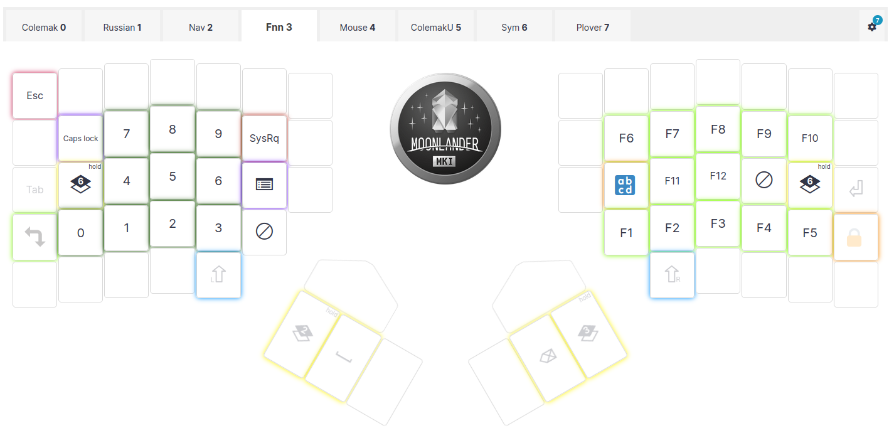
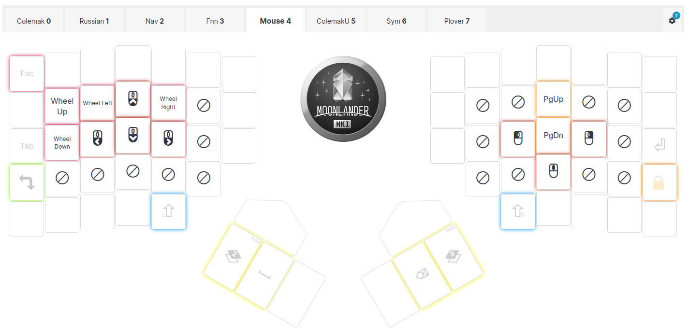
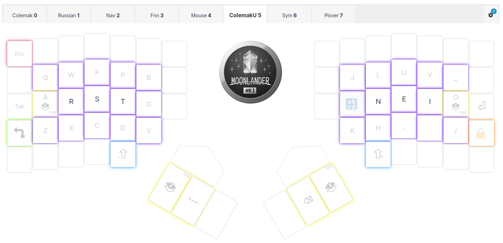
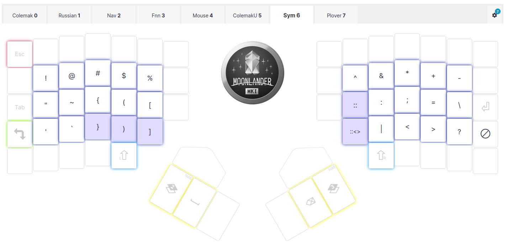

# Nick's layout

Derived from configuration in 
[Oryx](https://configure.zsa.io/moonlander/layouts/gqXJ4/latest/0)

This layout uses 56 keys only and fits to Iris rev4 keyboard.

The most notable features are:
- Colemak-DH on the base layer
- Shift, Ctrl and Alt modifiers are on the home row. 
- There are paired Shift keys, they are explicitly dedicated and never overloaded.
  The usage of the dedicated Shift keys greatly reduces the number of errors when typing text.
- Underscore is the default, `-` can be obtained either with Shift, or using Symbol layer 
- Buffer operations duplicated on the NAV layer on the right half, Ctrl+X is implemented as the chord (Ctrl+C, Ctrl+V)
- NAV layer is accessible with the most ease and contains not only cursor moves, 
  but buffer operations, word selections, modifiers and other helpers
- NUM layer is accessible with the most ease as well and contains not only digits, but Fn keys
- MOUSE layer is enabled with NAV and NUM modifiers pressed simultaneously
- SYM layer is accessible with home row pinkies hold, and is synchronized with the base layer; 
  this means the base symbols correspond to the shifted ones on the Symbol layer, it simplifies the layout remembering
- Combos for the Colemak layer:
  - `LCtrl = T + S`, `LAlt = S + R`, `LCtrl + LAlt = T + S + R`     
  - `RCtrl = N + E`, `LAlt = E + I`, `RCtrl + LAlt = N + E + I`     
- Combos for the Russian layer:
  - `LCtrl = А + В`, `LAlt = В + Ы`, `LCtrl + LAlt = А + В + Ы`
  - `RCtrl = О + Л`, `LAlt = Л + Д`, `RCtrl + LAlt = О + Л + Д`

- Hotkeys and symbols don't depend on the English/Russian system layout, achieved with `hotkey_conv` module.

## Layout Screenshots








## Installation

Clone [`ZSA QMK fork`](https://github.com/zsa/qmk_firmware), and there `firmware21` branch.
**TODO**

## Integration with `hotkey_conv` and/or `layer_lock`

The description of the `layer_lock` module is [done by its author, Pascal Getreuer](https://getreuer.info/posts/keyboards/layer-lock/index.html)
The description of the `hotkey_conv` module goes below.

## Hotkey conversion

People use not only languages with Latin letters, and the way OSes propose to work with other languages is to use
system layouts. I.e. if one writes something in English and then decides to switch to Russian (e.g. to answer to a
friend in a social network), he needs to press a keyboard shortcut to switch the system layout to Russian, and then
it presses the usual buttons on the keyboard, but instead of, say, `a` (assume it is Qwerty layout) the `ф` is being
entered. Now imagine the user wants to issue a hotkey in the text box, say, select all the text, so he presses `Ctrl+a`.
But the system is switched to the Russian layout already and instead obtains `Ctrl+ф` instead and the hotkey fails. 
Some applications do the translation, assuming we use Qwerty layout, some just ignore the hotkeys.

The thing gets much more complicated, when the one decides to learn Colemak layout to 
[increase his efficiency](https://typingdonewell.com/blog/qwerty-vs-dvorak-vs-colemak-detailed-comparison-with-my-tests/) 
and reduce the strain that was put on his hands. Then hotkeys are moved to the new positions, e.g. `Ctrl+p` moves from 
right pinky to the left pointer finger, but the user eventually gets used to them. The Russian layout, however,
is interpreted (if interpreted!) as mirror of the Qwerty layout, and the hotkeys get absolutely broken, the user
has to switch layout back to English, so he can issue even single hotkey and then has to switch to the Russian layout
again to continue typing his letter to the friend. So inconvenient!

So the approach I want to present is the following (QMK firmware is required, of course):

1. Do not touch the system, it should think the English layout is Qwerty and the Russian layout is Йцукен. The only 
change recommended is to make the shortcut between the languages to be `CapsLock` (but it is not mandatory).    
2. Create the separate layer in the keyboard, that contains Russian letters.
3. Add `hotkey_conv` to the firmware code.
4. Implement the `switch_system_layout` function.
5. Implement the language switch keycode.
6. Add the `process_hotkey_conversion` call to the `keymap.c`.
7. Fix the errors.

### Adding `hotkey_conv` to the firmware code.

Create `features` dir in your firmware code, and copy `hotkey_conv.h` and `hotkey_conv.c` there. 

Add the line `SRC += features/hotkey_conv.c` to the `rules.mk`.

### Implementing the function `switch_system_layout`

The implementation is very dependent on the host system and its tweaks. For example, `Gui + Space` shortcut works
for Windows and Ubuntu Linux out of the box, but doesn't work in MacOS and Android.
The current implementation is for `CapsLock` button to switch the system language layout. So if you want to
use `Gui + Space`, then the implementation might be the following:

```c
void switch_system_layout(uint8_t the_layer) {
  if (system_language_id != the_layer) {
    register_code(KC_LGUI);
    tap_code(KC_CAPS);
    unregister_code(KC_LGUI);
    system_language_id = the_layer;
  }
}
```
The function is implemented in `hotkey_conv.c`.

For other shortcuts the implementation should be changed accordingly.

### Implementing the language switch keycode.

We need to make some assumptions. Assume we have only two layers: English and Russian, the languages may be
not necessary those (they can be German, French, Korean, Arabic or others), but the current implementation 
supports two languages only.

Assume, the keymap contains the layers, corresponding to the languages. Assume, the layer for the English
is `_COLEMAK `, and the layer for the Russian is `_RUSSIAN` (they are just integer indices in `keymaps` array).

Define a constant for the language switch code, e.g.:

```c
#define L_RUS TG(_RUSSIAN)
```

Then you need to add the code `L_RUS` somewhere in the keymap matrix (everyone makes it differently), 
i.e. you need to have a button or buttons, with that you want to switch between the languages.

**TODO** 

Then add the dispatching code to the 
[process_record_user](https://github.com/qmk/qmk_firmware/blob/master/docs/custom_quantum_functions.md#example-process_record_user-implementation)
function.

```c
bool process_record_user(uint16_t keycode, keyrecord_t *record) {
  // ...
  if (!process_hotkey_conversion(keycode, record, current_layer_state)) {
    return false;
  }
  // ...
  switch (keycode) {
    case L_RUS:
      if (!record->event.pressed) {
        const bool is_ru_layer = IS_LAYER_ON_STATE(current_layer_state, _RUSSIAN);
        if (is_ru_layer) {
          switch_system_layout(_COLEMAK);
        } else {
          switch_system_layout(_RUSSIAN);
        }
      }
      break;
    // ...
  }
  // ...
}  
```

### Adding the `process_hotkey_conversion` call to the `keymap.c`

**TODO**

### Fixing the errors

The most funny part goes here
